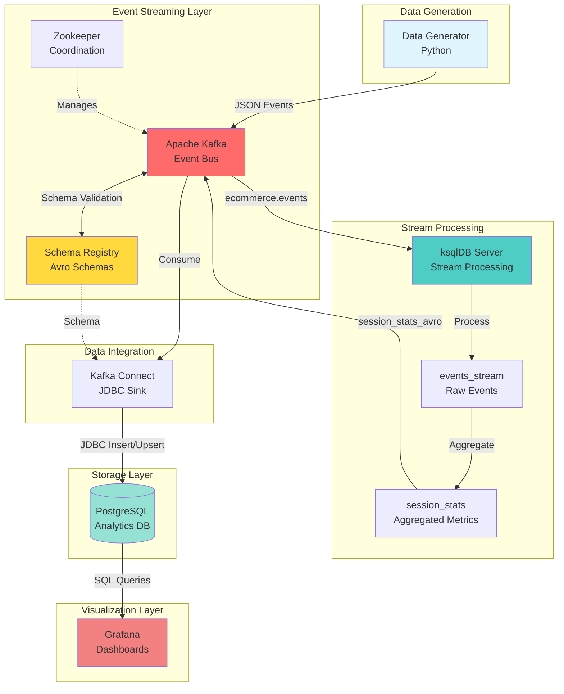

# System Architecture

## High-Level Architecture


## Data Flow

1. **Event Generation**: Python generator creates realistic e-commerce events
2. **Event Ingestion**: Events published to Kafka topic `ecommerce.events`
3. **Schema Validation**: Schema Registry validates Avro schemas
4. **Stream Processing**: ksqlDB processes events in real-time
5. **Aggregation**: Session metrics calculated and published to `session_stats_avro`
6. **Data Sync**: Kafka Connect streams to PostgreSQL
7. **Visualization**: Grafana queries PostgreSQL for live dashboards

## Component Details

| Component | Role | Port | Key Features |
|-----------|------|------|--------------|
| **Apache Kafka** | Event streaming platform | 9092 | Distributed, fault-tolerant messaging |
| **Zookeeper** | Cluster coordination | 2181 | Manages Kafka cluster state |
| **Schema Registry** | Schema management | 8081 | Avro schema versioning & validation |
| **ksqlDB** | Stream processing | 8088 | Real-time SQL on streams |
| **Kafka Connect** | Data integration | 8083 | JDBC sink connector |
| **PostgreSQL** | Analytical database | 5432 | Session aggregations & metrics |
| **Grafana** | Visualization | 3000 | Real-time dashboards |

## Event Schema

### Raw Event (JSON → Kafka)
```json
{
  "event_id": "evt_abc123",
  "event_type": "product_viewed",
  "session_id": "sess_xyz789",
  "user_id": "user_00123",
  "user_segment": "vip",
  "timestamp": "2025-11-17T12:00:00Z",
  "product_id": "prod_456",
  "price": 99.99,
  "cart_total": 199.98,
  "cart_item_count": 2
}
```

### Aggregated Session (Avro → PostgreSQL)
```json
{
  "SESSION_ID": "sess_xyz789",
  "USER_ID": "user_00123",
  "USER_SEGMENT": "vip",
  "SESSION_STATE": "shopping",
  "EVENTS_COUNT": 15,
  "PAGES_VIEWED": 5,
  "PRODUCTS_VIEWED": 8,
  "ITEMS_IN_CART": 2,
  "CART_VALUE": 199.98,
  "PURCHASE_COUNT": 1
}
```

## ksqlDB Processing

### Stream Definition
```sql
CREATE STREAM events_stream (
  event_id VARCHAR,
  event_type VARCHAR,
  session_id VARCHAR,
  user_id VARCHAR,
  user_segment VARCHAR,
  -- ... other fields
) WITH (
  KAFKA_TOPIC='ecommerce.events',
  VALUE_FORMAT='JSON'
);
```

### Aggregation Table
```sql
CREATE TABLE session_stats AS
SELECT
  session_id,
  LATEST_BY_OFFSET(user_id) AS user_id,
  COUNT(*) AS events_count,
  MAX(cart_total) AS cart_value,
  SUM(CASE WHEN event_type = 'purchase' THEN 1 ELSE 0 END) AS purchase_count
FROM events_stream
GROUP BY session_id
EMIT CHANGES;
```

## Scalability & Performance

- **Kafka Partitions**: Horizontal scaling for high throughput
- **ksqlDB State Stores**: RocksDB-backed stateful processing
- **PostgreSQL Indexing**: Optimized for analytical queries
- **Grafana Caching**: Query result caching for dashboard performance

## Monitoring Points

- Kafka broker metrics (throughput, lag)
- ksqlDB query performance
- Kafka Connect task status
- PostgreSQL query latency
- Grafana dashboard load times
